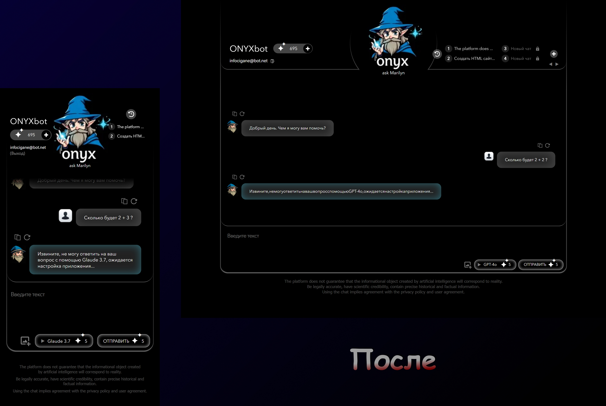

# $\color{turquoise}\textsf{ONYXbox}$

$\color{red}\text{Заказ с фриланс-биржи		}$

## $\color{mediumblue}\text{Описание работы }$:

Внешняя часть страницы взаимодействующей с нейросетями.

<u>**Основное техническое задание</u>** :

📌 Установить "слайдер" для блока с чатами пользователя , сделать его адаптивным.

📌 Увеличить область чата ( _в компьютерной версии_ ).

📌 Реализовать плавный переход сообщения пользователя в область чата.

📌 Организовать позиционирование чата так , чтобы он был на всю высоту экрана устройства ( _в мобильной версии_ ).

📌 Сделать возможным появление ScrollBar в чате , а так же отстилизовать их.

Ориентироваться на пример страницы [**rugpt.io**](https://rugpt.io/) .

🎯 $\color{mediumblue}\textsf{Основная задача}$ - Поправить вёрстку.

---

Макет -> [PSD](./files/onyxbox.psd)

Исходный вариант -> [**Git Pages**](https://artiom-work.github.io/Deepseek/)

Исправленный вариант -> [**Git Pages**](https://artiom-work.github.io/Onyx/)

---

## $\color{mediumblue}\text{Технологии, инструменты и способы вёрстки }$:

✅ Sass
✅ БЭМ
✅ Flexbox
✅ Валидная вёрстка
✅ Адаптивная вёрстка
✅ Семантическая вёрстка
✅ Кроссбраузерная вёрстка
✅ Оптимизация загрузки
✅ Lazy-loading
✅ SVG Sprites
✅ Pixel-perfect
✅ Git
✅ Figma
✅ Photopea
✅ VS Code
✅ Адаптация функциональности формы
✅ Шаблонизация HTML элементов (JS)
✅ Слайдер (HTML+CSS+JS)
✅ Swiper.js
✅ Hover/active-эффекты
✅ Анимации (JS)

---

## $\color{mediumblue}\text{Дополнительное описание:}$

_При формировании заказа и попытках править уже имеющуюся вёрстку , было принято решение "переверстать" всю страницу заново. Заказчик приложил самостоятельно созданный макет дизайна_.

$\color{lightgreen}\text{В результате было сделано дополнительно}$ :

💡**<u>Новая HTML структура страницы</u>** :

➕ Соблюдена семантика.

➕ Добавлены скрытые заголовки и скрытые элементы для улучшения специальных возможностей страницы и поиковой оптимизации.

➕ Область ввода сообщений пользователем , реализована формой.

➕ Добавлены элементы микроразметки

💡 **<u>Новая стилизация страницы (CSS/Sass/БЭМ)</u>** :

➕ Стили разбиты на логические блоки (_БЭМ_) и размещены по отдельным scss файлам (_удобство дальнейшей разработки_)

➕ Создана новая адаптивность страницы.

➕ Добавлены эффекты наведения и нажатия на элементы взаимодействия .

💡 **<u>Добавлена функциональность (JS)</u>** :

➕ Для блока с чатами пользователя внедрена и адаптирована "карусель" .

➕ Реализована кнопка выбора чата в блоке ввода сообщений пользователем. Кнопка добавлена тегом "select" , а для стилизации использован JavaScript.

➕ Реализован функционал переноса сообщения из поля ввода сообщения , в область чата.

_Так как взаимодействия с сервером не происходит на данном этапе , сообщения не уходят на сервер , а хранятся в локальном хранилище браузера пользователя (имитация)_

_Все ообщения добавляются с помощью "шаблонизации" динамически._

➕ Реализована анимация "плвного исчезовения" сообщения при отправке с задержкой , а так же плавноного появления в области чата (_сообщения пользователя_)

➕ Реализован функционал ответа "ботои" на каждое сообщение пользователя.

➕ Вывод сообщений "бота" в область чата добавлен с анимацией "печати".

➕ Реализовны кнопки повтора сообщений и пользователя и "бота".

➕ Добавлена функция комирования сообщения по соответствующей кнопке в области чата.

➕ Добавлена функция отправки сообщения по нажатию клавиши Enter.

💡 **<u>Валидация</u>**

💡 **<u>Оптимизация</u>**
